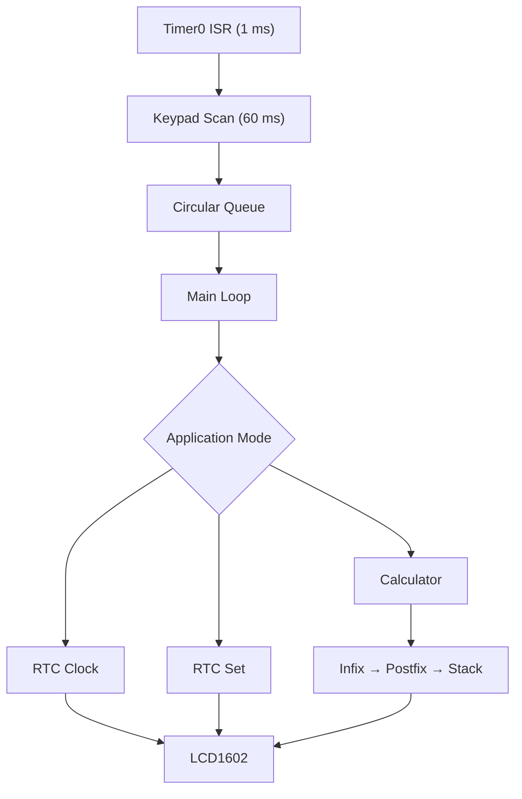

# RTC 시계 · 복합 계산기 시스템

ATmega128A에서 **DS1307 RTC, LCD1602, 4×4 Matrix Keypad**를 통합한 임베디드 펌웨어 프로젝트입니다.

전원을 켜면 날짜와 시간을 표시하고, 버튼으로 시간 설정 모드와 계산기 모드를 전환할 수 있습니다. 계산기는 여러 자리 정수, 사칙연산, 괄호 및 연산자 우선순위를 지원하며, 입력 처리에는 Circular Queue를, 수식 계산에는 Stack 기반 후위 표기식을 사용합니다.

## 프로젝트 개요

| 항목 | 내용 |
| --- | --- |
| 개발 기간 | 2026.07 |
| 수행 방식 | 개인 프로젝트 |
| MCU | ATmega128A, 16 MHz |
| 언어 | C |
| 개발 환경 | Microchip Studio, AVR-GCC |
| 주요 부품 | LCD1602, DS1307 RTC, 4×4 Matrix Keypad, Push Button |
| 주요 기술 | GPIO, Timer0 Interrupt, TWI/I²C, FSM, Circular Queue, Stack |

## 주요 기능

### RTC 시계

- DS1307의 날짜·시간 레지스터를 TWI/I²C로 읽기
- BCD 데이터를 10진수로 변환하여 LCD1602에 표시
- 날짜는 `YYYY-MM-DD`, 시간은 `HH:MM:SS` 형식으로 출력
- 1초 주기로 RTC 데이터를 갱신
- DS1307의 CH 비트를 0으로 설정하여 오실레이터 활성화

### 시간 설정

- 연·월·일·시·분·초 항목을 순서대로 선택
- 선택한 값을 증가 또는 감소
- 최솟값과 최댓값을 넘으면 반대쪽 값으로 순환
- 설정 모드 종료 시 변경된 값을 DS1307에 기록
- LCD 커서와 Blink를 이용해 현재 수정 항목 표시

### 복합 계산기

- 여러 자리 정수 입력
- `+`, `-`, `*`, `/` 사칙연산
- 괄호 입력 및 연산자 우선순위 처리
- 입력 취소(Clear)와 한 글자 삭제(Backspace)
- 16자를 넘는 수식은 LCD 화면을 좌우로 이동하며 표시
- 중위 표기식을 후위 표기식으로 변환한 뒤 Stack으로 계산

> 계산기는 정수 연산을 기준으로 구현되어 있습니다.

## 시스템 구조



메인 루프는 다음 세 가지 모드를 FSM 형태로 관리합니다.

| 모드 | 역할 |
| --- | --- |
| `MODE_RTC_CLOCK` | DS1307의 날짜와 시간을 LCD에 표시 |
| `MODE_RTC_SET` | 연·월·일·시·분·초 수정 |
| `MODE_CALC` | Keypad와 버튼 입력으로 복합 계산 수행 |

## 계산기 처리 흐름

1. Timer0 ISR에서 4×4 Keypad를 주기적으로 스캔합니다.
2. 감지된 키 입력을 Circular Queue에 저장합니다.
3. 메인 루프가 Queue에서 입력을 FIFO 순서로 읽습니다.
4. 숫자와 연산자로 중위 표기식 버퍼를 구성합니다.
5. Stack을 이용하여 중위 표기식을 후위 표기식으로 변환합니다.
6. 후위 표기식을 Stack으로 계산하고 결과를 LCD에 출력합니다.

예를 들어 다음 수식은 괄호와 연산자 우선순위에 따라 처리됩니다.

```text
((222 + 4) * 55) - 100 / 7 * 5 - 5 * 10
```

## 하드웨어 연결

### LCD1602 — 4-bit Mode

| LCD 신호 | ATmega128A | 설명 |
| --- | --- | --- |
| D4–D7 | PF4–PF7 | 상·하위 Nibble 데이터 전송 |
| RS | PC0 | 명령어/데이터 선택 |
| R/W | PC1 | LOW로 유지하여 쓰기 전용 사용 |
| E | PC2 | High → Low 펄스로 데이터 래치 |

### DS1307 — TWI/I²C

| DS1307 신호 | ATmega128A | 설명 |
| --- | --- | --- |
| SCL | PD0 | I²C Clock |
| SDA | PD1 | I²C Data |
| Slave Address | `0x68` | DS1307의 7-bit 주소 |

SDA와 SCL은 오픈 드레인 방식이므로 외부 Pull-up 저항이 필요합니다. 본 프로젝트에서는 Pull-up을 추가한 뒤 오실로스코프로 파형을 확인하여 통신을 안정화했습니다.

### 4×4 Matrix Keypad

| 구분 | ATmega128A | 설정 |
| --- | --- | --- |
| Column | PA0–PA3 | Output |
| Row | PA4–PA7 | Input, Pull-up |
| 입력 방식 | Active Low | 키를 눌렀다 뗄 때 한 번의 입력으로 처리 |

Keypad 배열은 다음과 같습니다.

|  |  |  |  |
| --- | --- | --- | --- |
| 1 | 2 | 3 | / |
| 4 | 5 | 6 | * |
| 7 | 8 | 9 | - |
| 미사용 | 0 | = | + |

### Push Button

| 버튼 | ATmega128A | RTC 시계 모드 | 시간 설정 모드 | 계산기 모드 |
| --- | --- | --- | --- | --- |
| BTN0 | PD3 | - | 값 감소 | 전체 삭제 |
| BTN1 | PD4 | - | 값 증가 | 한 글자 삭제 |
| BTN2 | PD5 | - | 수정 항목 이동 | `(` 입력 |
| BTN3 | PD6 | 시간 설정 진입 | 저장 후 시계로 복귀 | `)` 입력 |
| BTN4 | PD7 | 계산기 진입 | - | 시계로 복귀 |

버튼은 눌렀다 떼는 동작을 한 번의 입력으로 판단하며, 약 15 ms 기준으로 Chattering을 방지합니다.

## 타이밍

Timer0는 16 MHz 시스템 클록을 64분주하고, `TCNT0 = 6`부터 Overflow까지 250번 카운트하여 1 ms 기준 시간을 만듭니다.

- Timer0 Overflow: 1 ms
- Keypad Scan: 60 ms
- RTC/LCD 갱신: 1 s
- Push Button Debounce: 15 ms

## 프로젝트 구조

```text
.
├── main.c          # 주변장치 초기화, Timer0 ISR, 메인 FSM
├── mode.c/.h       # RTC 시계·시간 설정·계산기 모드
├── lcd.c/.h        # LCD1602 4-bit 드라이버와 화면 제어
├── i2c.c/.h        # TWI/I²C 통신과 DS1307 Read/Write
├── keypad.c/.h     # 4×4 Matrix Keypad 스캔
├── button.c/.h     # Push Button 입력과 Debounce
├── cal.c/.h        # 계산식 버퍼, 입력·삭제·실행 처리
├── stack.c/.h      # 중위→후위 변환과 후위 표기식 계산
├── queue.c/.h      # Keypad 입력용 Circular Queue
└── uart0.c/.h      # UART0 보조 모듈
```

## 빌드 및 실행

### 준비물

- ATmega128A 개발 보드
- LCD1602
- DS1307 RTC 모듈
- 4×4 Matrix Keypad
- Push Button 5개
- SDA/SCL Pull-up 저항
- AVR ISP Programmer

### Microchip Studio

1. 저장소를 Clone합니다.

   ```bash
   git clone https://github.com/sunghyun-nam/RTC_LCD_KEYPAD.git
   ```

2. Microchip Studio에서 ATmega128A용 **GCC C Executable Project**를 생성합니다.
3. 저장소의 `.c`, `.h` 파일을 프로젝트에 추가합니다.
4. MCU와 주변장치를 핀맵에 맞게 연결합니다.
5. 프로젝트를 Build한 뒤 ISP Programmer로 펌웨어를 기록합니다.

현재 코드는 `F_CPU = 16000000UL`을 기준으로 작성되어 있습니다. 다른 클록을 사용하면 Timer0와 I²C Bit Rate 설정을 함께 수정해야 합니다.

### 초기 날짜·시간 변경

부팅 시 DS1307에 기록할 초기값은 `i2c.c`의 `init_date_time()`에서 변경할 수 있습니다.

```c
ds1307->year    = 26;
ds1307->month   = 7;
ds1307->date    = 1;
ds1307->hours   = 16;
ds1307->minutes = 45;
ds1307->seconds = 0;
```

백업 배터리로 유지되는 기존 RTC 시간을 부팅 때 덮어쓰지 않으려면, 시작 과정에서 `init_ds1307()`을 호출하는 정책을 용도에 맞게 조정해야 합니다.

## 문제 해결

| 문제 | 원인 | 해결 |
| --- | --- | --- |
| DS1307 통신 불안정 | SDA/SCL의 Pull-up 부족으로 신호가 Floating | 외부 Pull-up 추가 후 I²C 파형 측정 |
| LCD 문자 깨짐 | 4-bit 초기화 순서와 명령 처리 Delay 부족 | 데이터시트 기반 초기화 순서 재구성 및 Delay 보강 |

## 구현을 통해 학습한 내용

- DS1307 데이터시트를 기반으로 START, Slave Address, ACK/NACK, STOP 시퀀스 구현
- LCD1602의 4-bit 초기화 및 Enable 신호 타이밍 제어
- Matrix Keypad의 Row/Column Scan과 Active Low 입력 처리
- 인터럽트와 메인 루프 사이의 입력 전달에 Circular Queue 적용
- Stack을 이용한 중위 표기식 변환과 후위 표기식 계산
- 소프트웨어 로직뿐 아니라 Pull-up, 신호 레벨, 타이밍 조건이 시스템 안정성에 미치는 영향 확인
